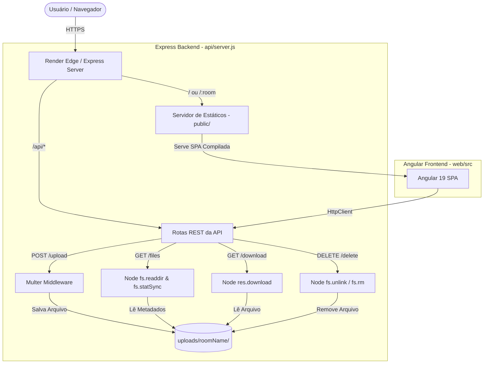

# Arquitetura do Sistema (ARCHITECTURE.md)

Este documento detalha a arquitetura técnica, modelo de implantação, diagrama de componentes e fluxos de dados do **DontFile**.

---

## 1. Visão Geral da Arquitetura

O DontFile adota uma arquitetura Monorepo baseada em duas aplicações desacopladas no desenvolvimento, mas integradas na implantação:

- **Backend (`/api`):** API RESTful desenvolvida em Node.js com Express e Multer para recepção e gerenciamento de uploads de arquivos no sistema de arquivos local.
- **Frontend (`/web`):** Single Page Application (SPA) desenvolvida em Angular 19 com Standalone Components para interação responsiva do usuário.



---

## 2. Estrutura de Monorepo e Deploy Integrado

### Ambiente de Desenvolvimento Local

No desenvolvimento local, a aplicação roda em dois processos independentes:

1. **Backend:** Executado via `node server.js` em `http://localhost:3000`.
2. **Frontend:** Executado via `ng serve` em `http://localhost:4200`. As requisições HTTP enviadas para `/api/*` são retransmitidas para a porta `3000` via [web/proxy.conf.json](../web/proxy.conf.json).

### Ambiente de Produção (Render)

Em produção, conforme instruído no arquivo [render.yaml](../render.yaml):

```yaml
buildCommand: cd web && npm ci && npm run build:deploy && cd ../api && npm ci
startCommand: cd api && npm start
```

1. O Angular é compilado gerando os artefatos estáticos na pasta `web/dist/dontfile-web/browser`.
2. O script `build:deploy` executa `rimraf ../api/public` e copia a saída do build para `api/public` usando `ncp`.
3. O servidor Express é iniciado em `api/server.js` e serve a pasta `public/` contendo a SPA.

---

## 3. Estrutura de Diretórios e Módulos

```
dontfile-angular-monorepo/
├── render.yaml               # Infraestrutura como Código do Render
├── README.md                 # Apresentação principal do repositório
├── BOOTSTRAP_PROJECT.md     # Guia de Onboarding (Raiz)
├── AGENTS.md                # Diretrizes para IAs (Raiz)
├── CHANGELOG_AI.md          # Registro de auditoria de IAs (Raiz)
├── docs/                     # Documentação técnica centralizada
│   ├── AUDIT.md              # Relatório de auditoria técnica
│   ├── ARCHITECTURE.md       # Documentação de arquitetura (este arquivo)
│   ├── SPEC.md               # Especificação técnica e contratos de API
│   ├── CONTEXT.md            # Contexto funcional
│   ├── MEMORY.md             # Memória permanente
│   ├── GOVERNANCE.md         # Governança do projeto
│   ├── ROADMAP.md            # Débitos técnicos e roadmap
│   ├── PATTERNS.md           # Padrões de código
│   ├── EXAMPLES.md           # Exemplos e snippets
│   └── DECISIONS.md          # Registro de ADRs
├── api/                      # Aplicação Backend (Node.js/Express)
│   ├── server.js             # Ponto de entrada da API e servidor HTTP
│   ├── package.json          # Dependências do backend
│   ├── uploads/              # Diretório efêmero de armazenamento
│   └── public/               # Build compilado do frontend Angular
└── web/                      # Aplicação Frontend (Angular 19)
    ├── angular.json          # Configuração do Angular CLI
    ├── proxy.conf.json       # Proxy de desenvolvimento local
    ├── package.json          # Dependências do frontend
    └── src/
        ├── index.html        # Shell HTML principal
        ├── styles.css        # Estilos globais
        └── app/
            ├── app.routes.ts # Definição de rotas da SPA
            ├── home/         # Componente da Landing Page
            └── room/         # Componente da Sala de Transferência
```

---

## 4. Estratégia de Roteamento

### Backend (Express)
- Rotas `/api/:room(*)/...` são interceptadas antes para fornecer respostas JSON ou streams de download.
- A rota raiz `app.get('/', ...)` serve `public/index.html`.
- A rota coringa `app.get('/:room(*)', ...)` serve `public/index.html` como fallback para permitir que o roteador client-side do Angular assuma a navegação sem erros 404 ao recarregar a página.

### Frontend (Angular Router)
- `''` -> `HomeComponent` (página inicial para informar o nome da sala).
- `'**'` -> `RoomComponent` (componente da sala que lê `router.url` para descobrir o nome da sala).

---

## Documentos Relacionados

- [SPEC.md](SPEC.md)
- [CONTEXT.md](CONTEXT.md)
- [MEMORY.md](MEMORY.md)
- [DECISIONS.md](DECISIONS.md)
- [README.md](../README.md)

---

## Confidence

### Alta
- Estrutura de código, fluxo de build e roteamento confirmados em [api/server.js](../api/server.js), [render.yaml](../render.yaml) e [web/src/app/app.routes.ts](../web/src/app/app.routes.ts).

### Média
- Nenhuma.

### Baixa
- Nenhuma.

---

## Validação Humana Necessária

- Nenhuma.
